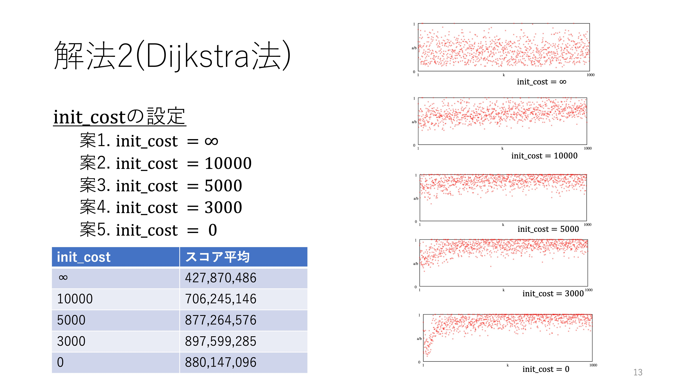
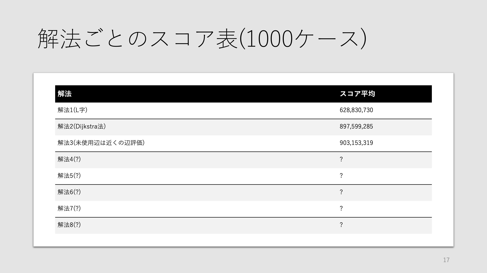

# AHC003

### 解法1(L字)
    simple_solution.py

### 解法2(dijkstra)
    C_3000.cpp

### 解法3(未使用辺は近くの辺評価)
    F2.cpp

### 解法4(近くの辺を加味して評価)
    G_8_3000.cpp

### 解法5(自身の辺情報を重要視)
    J.cpp

### 解法6(パス内の同じ列の長さで重みづけ)
    K.cpp

### 解法7(パス内の同じ列の長さで重みづけ(二乗))
    M.cpp

### 解法8(始めの方は情報を得るためのパス)
    N.cpp

